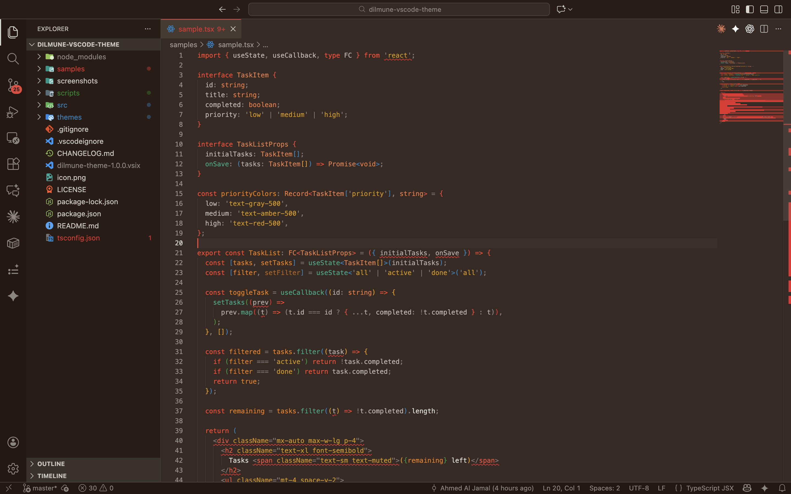
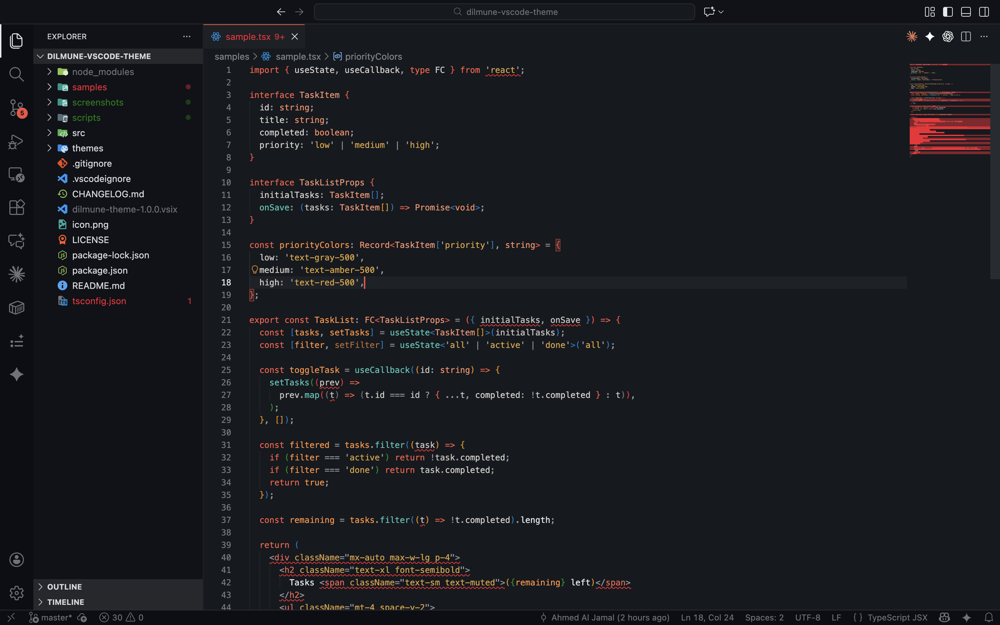

# Dilmune Theme

A warm theme family for Visual Studio Code — 12 themes across 4 modes, built around the Dilmune brand red `#d13e36` and earthy backgrounds.

## Screenshots

### Dilmune Dusk (Flagship)


### Dilmune Dark


### Dilmune Dim


### Dilmune Dark Soft


### Dilmune Light


## Modes

| Mode | Variants | Description |
|------|----------|-------------|
| **Light** | Default, Muted, High Contrast | Warm cream background with dark text. |
| **Dim** | Default, Muted, High Contrast | Mid-tone parchment. Darker than light, not dark. |
| **Dusk** | Default, Muted, High Contrast | Warm dark brown. The flagship. |
| **Dark** | Default, Soft, High Contrast | Deep blue-black. |

## Installation

1. Open **Extensions** (`Cmd+Shift+X` / `Ctrl+Shift+X`)
2. Search **"Dilmune Theme"**
3. Install, then `Cmd+K Cmd+T` to pick a variant

Or manually:
```bash
code --install-extension dilmune-theme-1.0.0.vsix
```

## Recommended Setup

```json
{
  "editor.fontFamily": "'JetBrains Mono', monospace",
  "editor.fontLigatures": true,
  "editor.fontSize": 14,
  "editor.lineHeight": 1.6,
  "editor.bracketPairColorization.enabled": true,
  "editor.guides.bracketPairs": true,
  "editor.cursorBlinking": "smooth",
  "editor.cursorSmoothCaretAnimation": "on",
  "editor.smoothScrolling": true,
  "editor.minimap.enabled": false,
  "editor.stickyScroll.enabled": true
}
```

[JetBrains Mono](https://www.jetbrains.com/lp/mono/) is our pick. [Fira Code](https://github.com/tonsky/FiraCode) and [Cascadia Code](https://github.com/microsoft/cascadia-code) also work well.

## Language Support

Hand-tested across all 12 themes: Go, TypeScript, TSX/JSX, Python, Rust, Java, C#, C/C++, PHP, SQL, CSS, JSON, YAML, Markdown.

Every language VS Code supports will work.

## The Brand

Built from the [Dilmune Cloud](https://dilmune.com) design system. The primary `#d13e36` comes from the Dilmune logo — inspired by ancient terracotta and the warmth of the Persian Gulf region where the Dilmune civilization thrived.

## License

[MIT](LICENSE)
