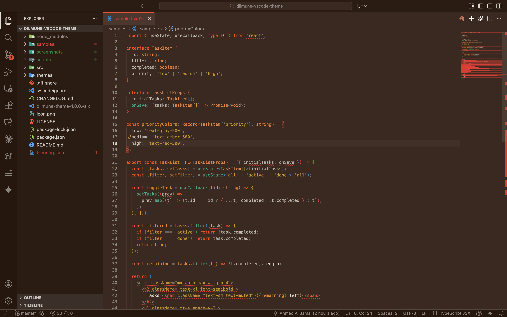
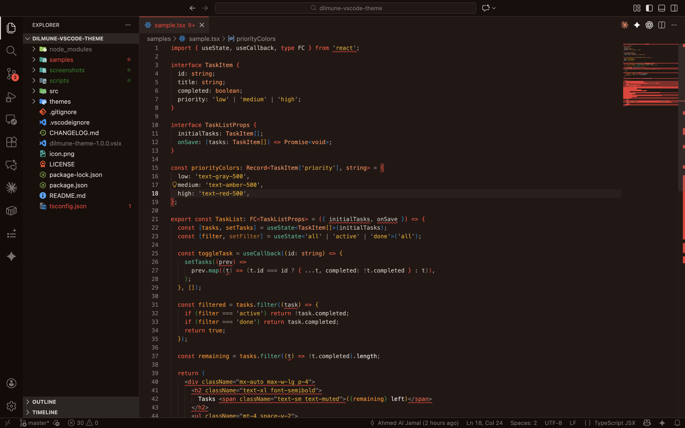

# Dilmune Theme

A warm, bold theme family for Visual Studio Code — built around the Dilmune brand red `#d13e36`, earthy backgrounds, and confident syntax colors. 14 themes across 5 modes. Dim is the flagship.

## The Modes

### Dim (The Flagship)

Dim is the soul of Dilmune. Warm dark brown backgrounds like a candlelit study. The brand red glows against it. This is where the theme lives.

| Theme | Description |
|-------|-------------|
| **Dilmune Dim** | The one. Warm dark brown, terracotta accents, everything you need. |
| **Dilmune Dim Warm** | Even warmer — amber-tinted brown, like clay near a kiln. |
| **Dilmune Dim Deep** | Darker mahogany. Night owl warmth that never turns cold. |
| **Dilmune Dim Muted** | Desaturated for marathon sessions. Same warmth, less intensity. |
| **Dilmune Dim High Contrast** | Sharp and accessible. Warmth with crisp edges. |

### Dark

Deep blue-black with presence. Not void — depth.

| Theme | Description |
|-------|-------------|
| **Dilmune Dark** | Deep blue-black with the brand red cutting through. |
| **Dilmune Dark Soft** | Slightly lifted. Gentle on the eyes, still dark. |
| **Dilmune Dark Muted** | Minimal. Desaturated. Zero distraction. |
| **Dilmune Dark High Contrast** | Maximum contrast for accessibility. |

### Light

Warm cream — never sterile white. Like aged paper.

| Theme | Description |
|-------|-------------|
| **Dilmune Light** | Off-white with warm undertones and bold syntax. |
| **Dilmune Light Muted** | Softer accents for a paper-like feel. |
| **Dilmune Light High Contrast** | Bold on cream. High readability. |

## Screenshots

### Dilmune Dim (Flagship)


### Dilmune Dim Warm


### Dilmune Dim Deep


### Dilmune Dark


### Dilmune Dark Soft


### Dilmune Light


## Installation

### From the Marketplace

1. Open VS Code
2. Go to **Extensions** (`Cmd+Shift+X` / `Ctrl+Shift+X`)
3. Search for **"Dilmune Theme"**
4. Click **Install**
5. `Cmd+K Cmd+T` → pick any **Dilmune** variant

### Manual Install

```bash
code --install-extension dilmune-theme-1.0.0.vsix
```

## The Dilmune Setup

This theme was built with intention. Here's how to get the full experience.

### Pick Your Font

We recommend fonts with character — nothing sterile. Pick one that matches your vibe:

#### JetBrains Mono — Dilmune's Pick

The font we use across Dilmune Cloud. Clean, modern, purpose-built for code. Excellent ligatures. This is the default recommendation.

```json
{
  "editor.fontFamily": "'JetBrains Mono', monospace",
  "editor.fontLigatures": true,
  "editor.fontSize": 14,
  "editor.lineHeight": 1.6
}
```

[Download JetBrains Mono](https://www.jetbrains.com/lp/mono/)

#### Fira Code — Warm & Rounded

Soft edges that match the warm Dilmune palette. Great ligatures. One of the most popular code fonts for a reason.

```json
{
  "editor.fontFamily": "'Fira Code', monospace",
  "editor.fontLigatures": true,
  "editor.fontSize": 14,
  "editor.lineHeight": 1.6
}
```

[Download Fira Code](https://github.com/tonsky/FiraCode)

#### IBM Plex Mono — Humanist Character

Slightly warm, humanist design. Has personality without being loud. Pairs beautifully with Dim mode.

```json
{
  "editor.fontFamily": "'IBM Plex Mono', monospace",
  "editor.fontSize": 14,
  "editor.lineHeight": 1.7
}
```

[Download IBM Plex Mono](https://github.com/IBM/plex)

#### Cascadia Code — Friendly & Modern

Microsoft's own. Relaxed, friendly feel that complements the cozy Dim modes.

```json
{
  "editor.fontFamily": "'Cascadia Code', monospace",
  "editor.fontLigatures": true,
  "editor.fontSize": 14,
  "editor.lineHeight": 1.6
}
```

[Download Cascadia Code](https://github.com/microsoft/cascadia-code)

#### Monaspace Argon — Spacious & Clean

GitHub's variable font family. Excellent readability with generous spacing.

```json
{
  "editor.fontFamily": "'Monaspace Argon', monospace",
  "editor.fontLigatures": true,
  "editor.fontSize": 14,
  "editor.lineHeight": 1.6
}
```

[Download Monaspace](https://monaspace.githubnext.com/)

### Complete Setup

Once you've picked your font, add these extras for the full Dilmune experience:

```json
{
  "editor.bracketPairColorization.enabled": true,
  "editor.guides.bracketPairs": true,
  "editor.cursorBlinking": "smooth",
  "editor.cursorSmoothCaretAnimation": "on",
  "editor.smoothScrolling": true,
  "workbench.list.smoothScrolling": true,
  "editor.minimap.enabled": false,
  "editor.renderWhitespace": "selection",
  "editor.stickyScroll.enabled": true
}
```

## Language Support

Syntax highlighting individually tuned for:

**Your stack:** Go, TypeScript, TSX/JSX, SQL, CSS, JSON, YAML, Markdown

**Also optimized:** Python, Rust, Java, C#, C/C++, PHP, JavaScript

Every language VS Code supports will work — the above have been hand-tested across all 14 themes.

## The Brand

The Dilmune theme is derived from the [Dilmune Cloud](https://dilmune.com) design system. The primary color `#d13e36` comes directly from the Dilmune logo — a warm, earthy red-orange inspired by ancient terracotta, desert stone, and the warmth of the Persian Gulf region where the Dilmune civilization thrived.

Every color in this theme exists for a reason. Nothing is default. Nothing is generic.

## License

[MIT](LICENSE)
