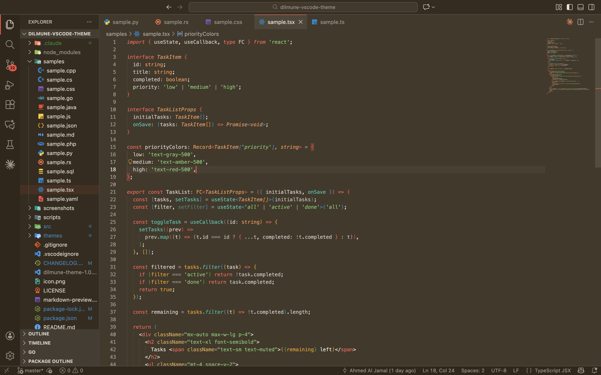
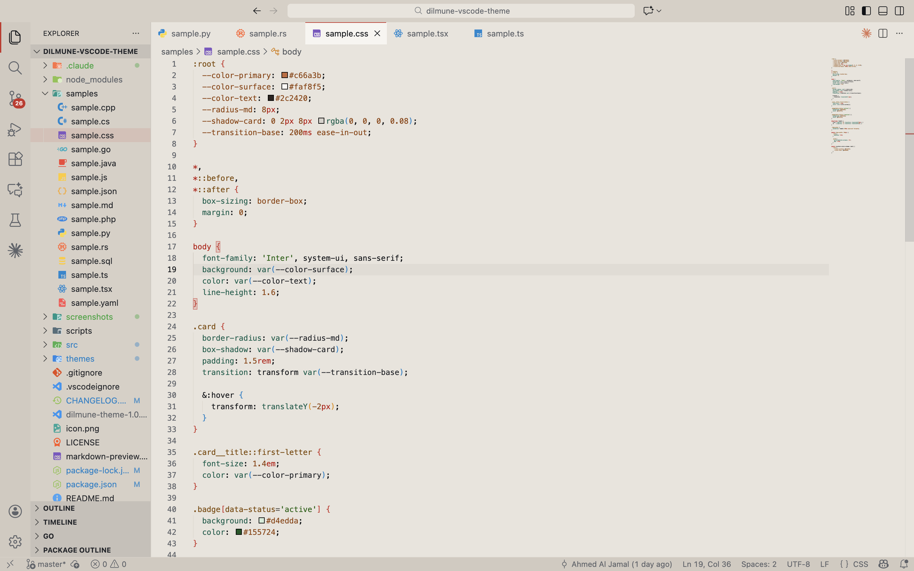
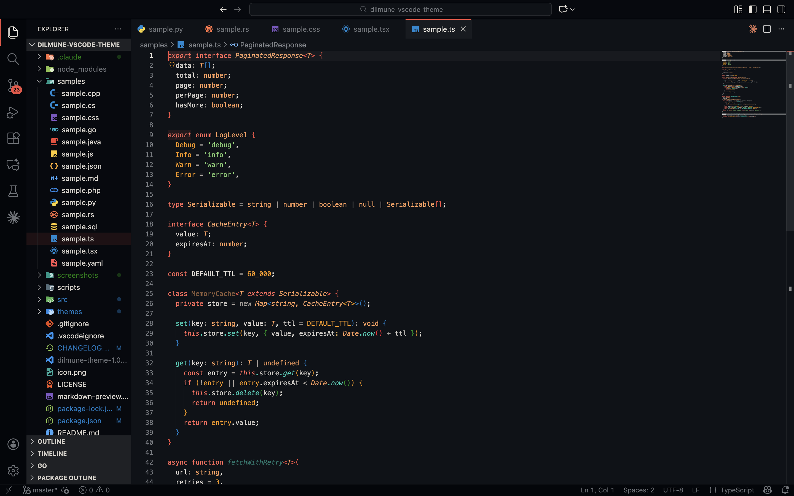

# Dilmune Theme

A warm, earthy theme that actually cares about contrast. If you like Gruvbox or Catppuccin but want something that feels like aged paper and terracotta — Dilmune is for you.

Built from OKLch color space for perceptually uniform contrast across every mode.

## Screenshots

### Dilmune Dusk (Flagship)


### Dilmune Light


### Dilmune Dark


## Themes

| Theme | Type | Description |
|-------|------|-------------|
| **Dilmune Dusk** | Dark | Warm candlelit brown — the flagship |
| **Dilmune Dusk High Contrast** | HC Dark | Accessibility variant |
| **Dilmune Light** | Light | Warm cream parchment |
| **Dilmune Light High Contrast** | HC Light | Accessibility variant |
| **Dilmune Dark** | Dark | Deep blue-black |
| **Dilmune Dark High Contrast** | HC Dark | Accessibility variant |
| **Dilmune Dim** | Light | Mid-tone parchment — between light and dark |

## Install

1. Open **Extensions** (`Cmd+Shift+X` / `Ctrl+Shift+X`)
2. Search **"Dilmune Theme"**
3. Install, then `Cmd+K Cmd+T` to pick a variant

Or manually:
```bash
code --install-extension dilmune-theme-1.1.0.vsix
```

## Recommended Setup

```json
{
  "editor.fontFamily": "'JetBrains Mono', monospace",
  "editor.fontLigatures": true,
  "editor.fontSize": 14,
  "editor.lineHeight": 1.6,
  "editor.bracketPairColorization.enabled": true,
  "editor.guides.bracketPairs": true,
  "editor.cursorBlinking": "smooth",
  "editor.cursorSmoothCaretAnimation": "on",
  "editor.smoothScrolling": true,
  "editor.minimap.enabled": false,
  "editor.stickyScroll.enabled": true
}
```

[JetBrains Mono](https://www.jetbrains.com/lp/mono/) is our pick. [Fira Code](https://github.com/tonsky/FiraCode) and [Cascadia Code](https://github.com/microsoft/cascadia-code) also work well.

## Language Support

Hand-tested: Go, TypeScript, TSX/JSX, Python, Rust, Java, C#, C/C++, PHP, SQL, CSS, JSON, YAML, Markdown.

Works with every language VS Code supports.

## Color Philosophy

Every color in Dilmune is defined in OKLch — a perceptually uniform color space where equal numeric changes produce equal visual changes. This means:

- Contrast ratios are enforced at build time (WCAG AA minimum)
- No two syntax tokens are perceptually indistinguishable (delta-E > 5.0)
- Variants are generated programmatically — consistency is mechanical, not manual

The palette: terracotta (keywords), sage (strings), verdigris (functions), clay-rose (types), amber (constants), fossil (decorators), dune (operators). All grounded in warm earth tones inspired by the ancient Dilmune civilization.

## License

[MIT](LICENSE)
